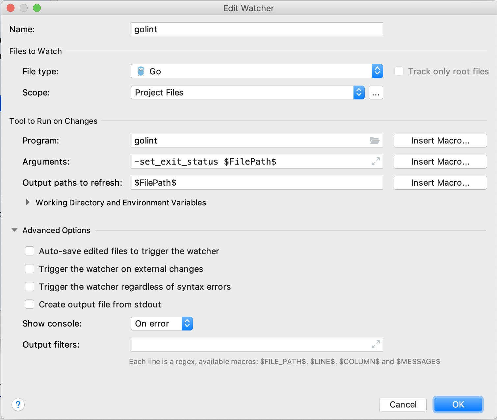

# Get started with GoLand
GoLand is a greate IDE for programming with golang, especially for Intellij user. Since both GoLand and Intellij are developed by JetBrains, they share lots of features. For beginner who does not use JetBrains product before, I suggest to read the official doc [Discover GoLand](https://www.jetbrains.com/help/go/discover-goland.html) first. This guide is intented to tell some advanced features and issues.

## Configure GoLand
### Configure GoLand with golint
The newest version of GoLand comes with built-in support for running `gofmt`, `goimports` and `gometalinter` on every file save. If you want to run just `golint`, Open `Preferences`, and under `Tools -> File Watchers` add following `custom` watcher:
